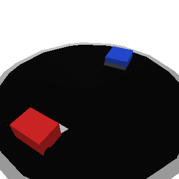
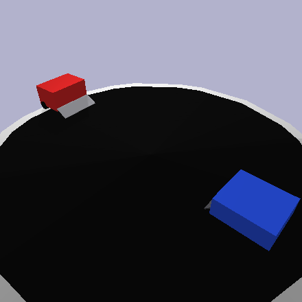
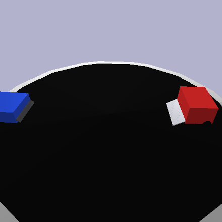
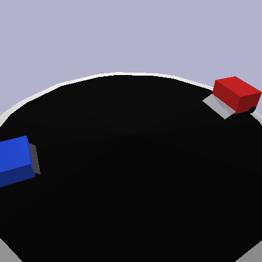
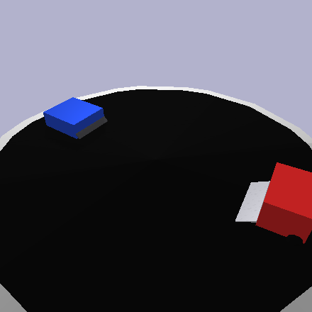
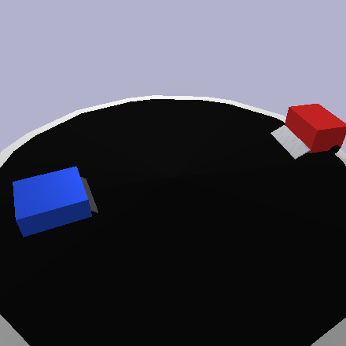

# Realistic Sumo 3D Simulation

PyBullet-based mini-sumo arena for training a reinforcement-learning policy that
deploys to an Arduino Nano. The agent learns to push a zoo of scripted opponents
off a 70 cm dohyo using only physically-realisable sensors (3 ToF rays + 2 rear
line sensors), then its weights are exported as a PROGMEM C++ header for
on-device inference. Two policies are trained and deployable: a **Dueling Double
DQN** ("Stage-A") and a stronger **discrete PPO** (the current deploy model).


## Demo

The deployed policy (robust PPO) pushing opponents off the 70 cm dohyo at
mult 3.0 — **red = agent, blue = opponent** (PyBullet OpenGL renderer):

| vs NovaMax (boss) | vs Tracker (hardcoded) | vs Charger |
|---|---|---|
|  |  |  |
| **vs Dodger (evasive)** | **vs Wedger** | **vs Orbiter (held-out)** |
|  |  |  |

## What's in the repo

```
sumo_env.py           Gymnasium env: PyBullet world, IR raycasts, reward stack, DR,
                      hardcoded action guards, chassis/power domain randomization
obs_stack.py          RawDistanceStack wrapper: K=4 frame-stack -> 21-D observation
combat_policy.py      scripted policy used as the BC teacher
train_dqn_3d.py       DQN: BC pretrain + 5-phase online RL (Dueling Double DQN)
train_ppo_3d.py       discrete PPO: BC warm-start, GAE, curriculum, resume/zero-entropy/
                      robust modes, watch-every-100k
export_weights.py     PyTorch state-dict -> PROGMEM C++ header
opponents/            7 zoo controllers (dodger, spinner, rammer, wedger, novamax,
                      charger, tracker) + 2 held-out (feinter, orbiter)
assets/               robot.urdf, novamax.urdf, STL meshes
scripts/              watch_3d, watch_gauntlet, play_vs_dqn_3d, eval_best,
                      agent_vs_agent (self-play head-to-head), human_play
tests/audit_3d.py     86-test correctness suite (run after any env change)
checkpoints/          committed model weights (DQN Stage-A + PPO line)
firmware/v3_deploy/   legacy 12-D DQN sketch
firmware/v4_deploy/   Stage-A 21-D DQN sketch (K=4 ring buffer)
firmware/v5_deploy/   PPO robust 21-D sketch + the 4 hardcoded action guards  <-- deploy
```

## Architecture

**Observation (21-D)** — `obs_stack.RawDistanceStack` stacks the 3 ToF distances over
the last `K=4` frames (oldest-first) and appends 9 single-frame engineered features:

| block | feature | range |
|---|---|---|
| 0-11 | front/left/right normalised distance × 4 stacked frames | [0, 1] |
| 12 | `last_seen_dir` latch | {-1, 0, +1} |
| 13-14 | rear-left / rear-right line sensors over the white border | {0, 1} |
| 15-16 | previous tick's raw motor command | [-1, +1] |
| 17 | engagement timer (consecutive ticks with front IR < 0.15) | [0, 1] |
| 18 | yaw-rate proxy (decayed L-R accumulator) | [-1, +1] |
| 19-20 | front- / lateral-IR temporal deltas (closing rate) | [-1, +1] |

**Action:** `Discrete(9)` — Cartesian product of `(-1, 0, +1)` on each wheel
(continuous `Box(2,)` is also wired in the env).

**Networks:** both use a 32×32 MLP trunk (Nano-deployable in float32).
- DQN: Dueling Double DQN, n-step returns (n=3), Polyak target, DQfD-style demo
  retention to prevent catastrophic forgetting.
- PPO: actor-critic sharing `DuelingQNet`'s submodule layout (so `argmax` of the actor
  head = the deployable action and the same export/eval tooling works), GAE(λ=0.95),
  clipped objective + per-update KL early-stop, critic warm-up before the actor moves.

**Hardcoded action guards** (observable-only, replicated 1:1 in firmware): a safety
override (rear-edge reflex + anti-blind-charge), a 100 ms opening forward charge, a
spawn guard (early net-backward → forward — kills the spawn-near-rim self-outs), and
an anti-stall (too many idle commands → forward).

**Reward shaping:** terminal split (win +10, push_loss -15, mutual_out -20, self_out
-50, timeout -10) + dense shaping (approach, engage, wedge, tracking/flank, action
consistency, plus opt-in still / backward penalties).

**Domain randomization:** chassis mass ±5%, friction, motor deadzone, battery sag,
action latency, IR Gaussian noise (per-step dropout disabled for stability), opponent
behaviour (speed/tracking/reaction), and — for robustness training — per-episode
opponent **power** (torque mult), and **hardware** (chassis: robot.urdf ↔ novamax.urdf).

## Why the forward edge is the hard part

The robot has only **rear** line sensors, so the front rim is unobservable. ~92 % of
losses at high torque were forward drive-offs, and no reward shaping (privileged-radius,
heavy terminal penalty, observable proxy) could fix what the policy cannot perceive. The
working answer is hardcoded observable guards (above) + a spawn-window that turns early
backward commands into forward — together they cut the self-out rate roughly in half.

## Physics fixes (3D PyBullet)

- **Orbital deadlock** — fixed via low chassis friction + a stuck-detector lateral kick
  after 8 ticks of stationary contact.
- **Push impotence** — `WHEEL_FRICTION` 1→2, anisotropic wheel friction, and free-spin
  idle motors (no artificial active-brake).

Verified in [tests/audit_3d.py](tests/audit_3d.py) (86 tests).

## Setup

```powershell
conda create -n sumo -c conda-forge python=3.12 pybullet numpy gymnasium -y
conda activate sumo
pip install -r requirements.txt
```

Windows quirks: set `KMP_DUPLICATE_LIB_OK=TRUE`, import `torch` before `numpy`/`pybullet`,
and launch via `cmd /c "call ...\activate.bat sumo && python ..."` so DLL paths resolve.

## Run

```bash
# Sanity-check the env (~30 s, should print "PASS: 86  FAIL: 0").
python tests/audit_3d.py

# Train DQN (1M steps): BC pretrain + 5-phase online curriculum.
train.bat

# Train discrete PPO (resume/finetune from a checkpoint):
#   PPO_RESUME=<ckpt>            continue at fixed mult 3.0
#   PPO_ENT0=1                   zero-entropy sharpening
#   PPO_ROBUST=1                 + opponent power/speed/hardware DR
set PPO_RESUME=checkpoints/ppo_robust_best.pt && set PPO_ROBUST=1 && python -u train_ppo_3d.py

# Headless eval vs the zoo + held-out (per-opponent WR + self-out breakdown):
python scripts/eval_best.py --ckpt checkpoints/ppo_robust_best.pt --n-eps 30 --mult 3.0 --spawn-guard

# Watch one model fight every opponent (add --guard for the deployed config,
# --same-chassis to put the opponent on the agent's robot, --opp <name> for one).
python scripts/watch_gauntlet.py --ckpt checkpoints/ppo_robust_best.pt --guard --mult 3.0

# Head-to-head between two policies (same chassis); --gui to watch.
python scripts/agent_vs_agent.py --a checkpoints/ppo_robust_best.pt --b checkpoints/dqn3d_stack_stageA_best.pt --gui
```

## Results (eval at mult = 3.0, greedy)

| opponent | DQN Stage-A | **PPO robust** |
|---|---|---|
| seen-zoo mean | 51 % | **73 %** |
| novamax | 52 % | **70 %** |
| charger | — | 70 % |
| tracker (hardcoded scripted robot) | — | 87 % (67 % same-chassis) |
| held-out (unseen) mean | ~48 % | **78 %** |
| self-out rate | ~41 % | **~18 %** |

The PPO model meets the 65 %-overall / 55 %-novamax target with the lowest self-out
rate, and is trained against a diverse opponent distribution (varied power, speed,
intelligence, and hardware) so it generalises to unseen robots.

## Deploying to Arduino Nano

The trained policy ships as a single C++ header (`neural_net_v6_3d.h`, weights in
PROGMEM + a `predict_action()` forward pass) next to a sketch. Three ready folders:

- `firmware/v5_deploy/` — **PPO robust (current)**: 21-D, K=4 distance ring buffer, all
  four action guards replicated in `loop()`.
- `firmware/v4_deploy/` — DQN Stage-A (21-D).
- `firmware/v3_deploy/` — legacy 12-D DQN.

To flash: open the folder's `.ino` in the Arduino IDE → Board: Arduino Nano
(ATmega328P) → Upload. Serial at 115200 prints `model self-test mismatches: 0` then
`ready (...)`; it refuses to drive if the flashed weights are corrupted.

**Hardware:** 3× VL53L0X ToF (front/left/right, XSHUT D2/D3/D4), TB6612FNG motor driver
(left A1/A2=D10/D9 PWM=D11, right B1/B2=D6/D7 PWM=D5, STBY=D8), 2× QTR-1A rear line
sensors (A0/A1).

## Branches

- `alg/improvment` — the DQN line + Stage-A deploy (`firmware/v4_deploy`).
- `pol/ppo` — the discrete PPO experiment + robust deploy (`firmware/v5_deploy`).

## Contributing

See [CONTRIBUTING.md](CONTRIBUTING.md).

## Author

Narek Stepanyan
